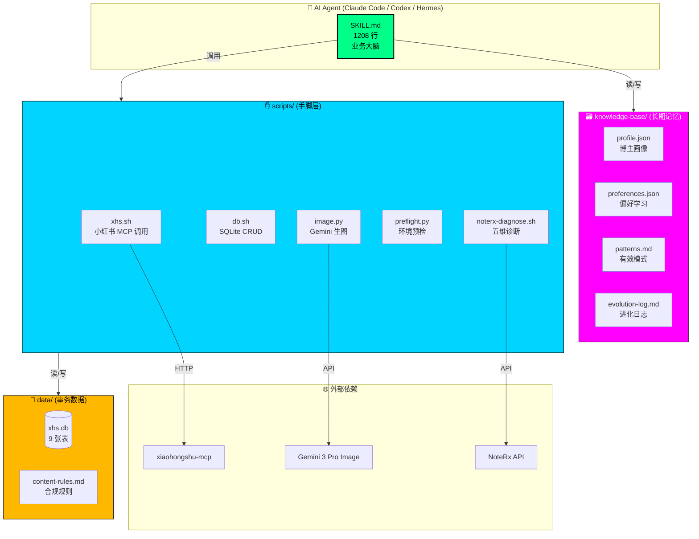
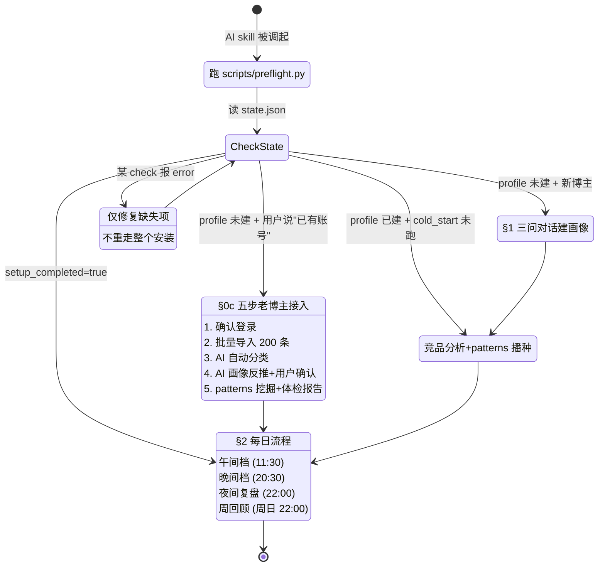
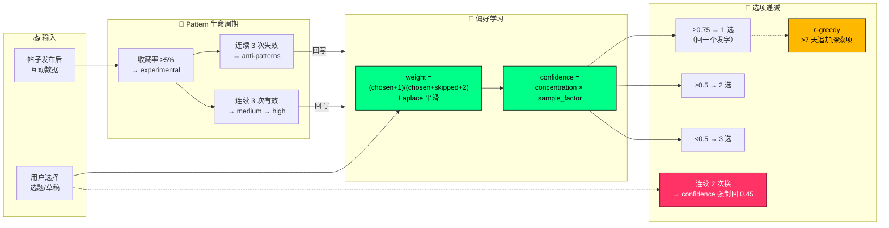

# 架构图（3 张 Mermaid）

> 用 https://mermaid.live 粘贴导出 SVG/PNG，放 README 顶部或博客配图。
> 或本地 `mmdc -i diagram.mmd -o diagram.svg -b transparent`。

---

## 图 1 · 全景架构（Skill-as-Brain）

这是最"招牌"的一张，放 README 顶部或 landing 首屏。



---

## 图 2 · 业务路由（§0a）

展示 AI 每次被调起时如何决定走哪条路径——解释"skill 不只是 prompt，是状态机"。



---

## 图 3 · 自进化引擎（§4）

展示偏好学习、选项递减、探索保底的完整决策链——解释"越用越懂你"到底怎么实现。



---

## 渲染建议

### 本地导出（推荐）

```bash
# 安装 mermaid CLI
npm install -g @mermaid-js/mermaid-cli

# 把每张图存成 .mmd 文件，导出
mmdc -i diagram-1.mmd -o diagram-1.svg -b transparent -t dark
```

### 在线渲染

1. 打开 https://mermaid.live/
2. 粘贴上面 mermaid 代码块
3. 选择 `neutral` / `dark` 主题（和 landing 的赛博风搭）
4. 下载 SVG 或 PNG

### 在 README 里引用

```markdown

```

把导出的 SVG 放 `docs/images/`（新建目录），README 顶部引用。
